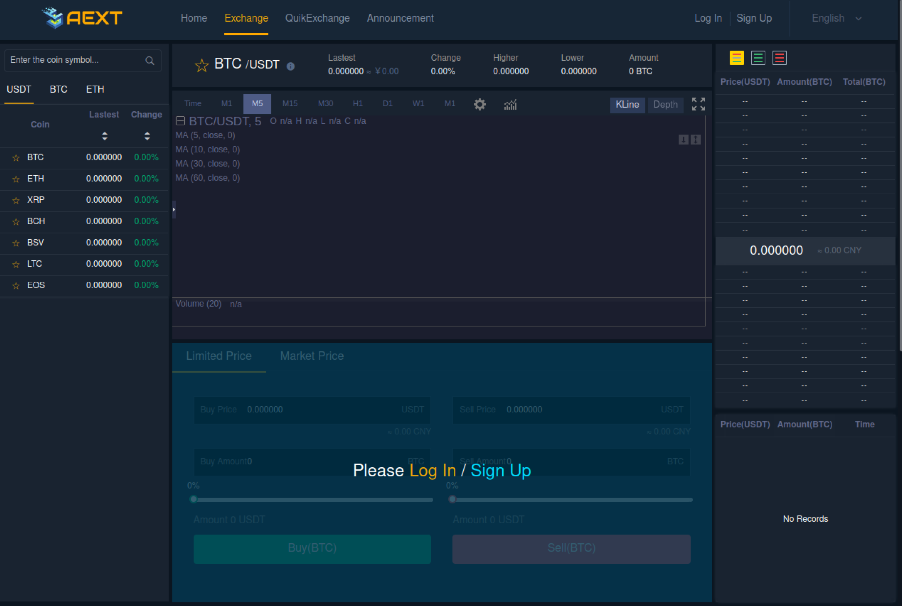

AEXT Exchange Developer Log
===

This is the log about developing AEXT Exchange. 

This is the close source business project.

 

------

Revision: 8f27fddbf33ec05c3d7bf4c7e663f6873fb6fd8c
Author: Rojar Smith <rojarsmith@gmail.com>
Date: 2021/6/6 下午 02:13:10
Message:
Junit 5 support test of springboot library module with H2 database.

Revision: c67bab07276db36f53fe69e5e0a441a3f07352c3
Author: Rojar Smith <rojarsmith@gmail.com>
Date: 2021/6/6 上午 10:34:00
Message:
Add the @autowired work template.

Revision: 33b79a514cb69496434ee3a19ccc87c79ae03650
Author: Rojar Smith <rojarsmith@gmail.com>
Date: 2021/6/5 下午 10:59:13
Message:
Add custom enum and improve build.

Revision: 5b16051e4f371735e2c04dbc4acca459a04e6f44
Author: Rojar Smith <rojarsmith@gmail.com>
Date: 2021/6/5 下午 10:53:17
Message:
Fix unit test and improve build file.

Revision: afbbf64bb5c09fe7b617241250fd06db0f50e3df
Author: Rojar Smith <rojarsmith@gmail.com>
Date: 2021/6/5 下午 02:52:06
Message:
Add multi language message.

Revision: 32d9f4ac2b076c41bb84866617a5300d1a6fa8d8
Author: Rojar Smith <rojarsmith@gmail.com>
Date: 2021/6/5 下午 02:30:38
Message:
Add internationalization of REST.

Revision: a143444c5c1f0764568eac635be9cbe79917b2ec
Author: Rojar Smith <rojarsmith@gmail.com>
Date: 2021/6/5 下午 01:01:59
Message:
Add the return message show errors.

Revision: e2e1665288e03b6e9eb89f6898d8712a852ca0e4
Author: Rojar Smith <rojarsmith@gmail.com>
Date: 2021/6/5 上午 11:53:31
Message:
Add multi language and payload of register by email.

Revision: 0205c584846e871398491460e6e8b3bc6eebbb92
Author: Rojar Smith <rojarsmith@gmail.com>
Date: 2021/6/5 上午 09:51:41
Message:
Add the base controller.

Revision: b4ec89fa4a2aabcf99aaad29719e7c7f240b5862
Author: Rojar Smith <rojarsmith@gmail.com>
Date: 2021/6/5 上午 09:36:00
Message:
Add MessageResponse for common return message.

Revision: ee5c28f0f0f597f0b6d1e64fa1a7a40fc58ed15c
Author: Rojar Smith <rojarsmith@gmail.com>
Date: 2021/6/4 下午 11:39:43
Message:
Add new empty project core-base for shared code base.

Revision: 4999de2353dd3c93ab43e5dbe609a67ec23f87f4
Author: Rojar Smith <rojarsmith@gmail.com>
Date: 2021/6/4 下午 11:38:47
Message:
Add Eureka server.

Revision: 86ddb459ad06a2394ab3dd044779e5f0187e96c5
Author: Rojar Smith <rojarsmith@gmail.com>
Date: 2021/6/4 下午 10:23:07
Message:
Add the new empty project for service discover and registration.

Revision: 250997e5c8114d8331256d620d17259f65ad5d1f
Author: Rojar Smith <rojarsmith@gmail.com>
Date: 2021/6/4 下午 10:22:11
Message:
Move core-service to backend.

Revision: 3f7fa9680061ef97d7f27e9bebf893e6aade1a51
Author: Rojar Smith <rojarsmith@gmail.com>
Date: 2021/6/4 下午 10:04:10
Message:
Add the new project template.
